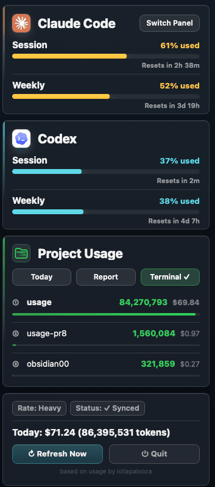

# usage

> Claude Code & Codex usage monitor — pin your quota to the macOS menu bar

[Traditional Chinese](README.md) · English &nbsp;|&nbsp; 💬 [Discussions](https://github.com/aqua5230/usage/discussions) &nbsp;|&nbsp; 🌐 [Landing page](https://aqua5230.github.io/usage/)

[](https://github.com/aqua5230/usage/actions/workflows/check.yml)
[](https://github.com/aqua5230/usage/releases/latest)
[](https://www.python.org/)
[](https://www.apple.com/macos/)
[](LICENSE)

<p align="center">
  
</p>

`usage` is a macOS menu bar tool that pins your **Claude Code and Codex** usage to the top-right of your screen. Click the icon for a popover showing Session, Weekly, per-project usage (today / 7-day / monthly), and today's token usage and cost estimate.

All numbers come from local files written by Claude Code and Codex — it **never calls the Anthropic / OpenAI API** and **never reads the Keychain**, so it avoids the observer effect of "pinging once a minute counts as usage."

## ✨ Features

- **🐾 Menu bar usage monitor**: pins Claude Code + Codex 5-hour / 7-day quota to the top-right. Percentages share the bar color (yellow / green / red) so the warning level reads at a glance. Click for Session, Weekly, per-project usage, and today's cost estimate.
- **🔄 Progress Concierge**: when you open a new Claude Code session, it automatically hands your last progress (your last request, the commits you made, any unfinished todos) to the AI — no re-explaining. Fully local, zero API, off by default. See the [landing page](https://aqua5230.github.io/usage/#resume).
- **🎨 9 visual panel themes**: Classic, Matrix, Windows 95, Newspaper, Cloud Observation, Midnight Aquarium, Prism Arcade, Black Hole, World Cup 2026 — switch with one click.
- **📊 HTML deep reports**: daily / weekly / monthly token + cost trends, per-project rankings, top-model distribution, shareable with a built-in "hide project names" toggle.
- **🌍 5-language i18n**: Traditional Chinese / Simplified Chinese / English / Japanese / Korean, auto-following the system language.

## 📦 Install

### Homebrew (recommended)

One command to install; `brew upgrade` keeps it current:

```bash
brew tap aqua5230/homebrew-usage
brew install aqua5230/homebrew-usage/usage
```

After install, find `usage.app` under `/opt/homebrew/Cellar/usage/` and right-click → Open once to pass Gatekeeper. Then optionally symlink it to Applications:

```bash
ln -s $(brew --prefix)/Cellar/usage/$(brew list --versions usage | awk '{print $2}')/usage.app /Applications/usage.app
```

### Download the app

Go to the [GitHub Releases page](https://github.com/aqua5230/usage/releases/latest) and download the latest `usage.app.zip`. Unzip it and move `usage.app` wherever you like (e.g. `/Applications`).

⚠️ Because this app is not signed with an Apple Developer certificate, **macOS Gatekeeper will block the first launch**. To open it: find `usage.app` in Finder → right-click → Open → confirm Open. After that, double-clicking works normally.

### First launch: set up the status line

The first time you open usage, if you have already used Codex, the Codex card usually reads `~/.codex/sessions` and shows data directly. If you use Claude Code, the popover may show a **"Set Up Status Line"** button — click it to install the hook (a script that runs every time Claude Code refreshes its status line).

Restart the relevant tool afterward: restart Codex once; if Claude Code was configured too, fully quit Claude Code (Cmd+Q) and re-open it so the data lands on disk.

Once set up, the bottom of the Claude Code window will show a status line like this — **5h / 7d quota bars, context usage, session duration, current model — all on one line**:

<p align="center">
  
</p>

To toggle the status line on / off later (e.g. you want to see Claude Code's native status line), click the **CLI ✓** button in the menubar popover's "Projects" section toolbar.

> Running from source, or want to install via the command line? See the [development docs](docs/DEVELOPMENT.en.md).

## Comparison

| Feature | usage | ccusage | TokenTracker |
|---------|:-----:|:-------:|:------------:|
| macOS menu bar | ✅ | — | ✅ |
| Claude Code usage | ✅ | ✅ | ✅ |
| Codex usage | ✅ | — | ✅ |
| HTML deep reports | ✅ | ✅ | — |
| 5-language i18n | ✅ | — | — |
| 9 visual panel themes | ✅ | — | — |
| Progress Concierge (session resume) | ✅ | — | — |
| Zero API calls | ✅ | ✅ | ✅ |
| Open-source license | AGPL-3.0 | MIT | — |

## Requirements

- macOS
- Claude Code or Codex has been used at least once so local usage data exists
- (Only if running from source) Python 3.13

## Troubleshooting

The "Fix" column distinguishes three kinds of users — find yours first:

- **.app users** — downloaded `usage.app.zip` from GitHub Releases, unzipped, dragged `usage.app` to `/Applications`, double-click to launch like any Mac app. No Terminal, no Python.
- **LaunchAgent users** — cloned the source and ran `./scripts/install-launchagent.sh` so macOS auto-starts usage on login.
- **Source users** — cloned the source and run `python3 main.py` manually in Terminal each time.

| Symptom | Likely cause | Fix |
|---------|--------------|-----|
| Menu bar shows `--` | No Codex `rate_limits` yet, or the Claude Code hook has not refreshed | Run one Codex conversation first. For Claude Code integration, **.app users** click "Set Up Status Line"; **Source users** run `python3 main.py --setup` |
| Accidentally hit "Quit", paw icon disappeared from the menu bar | "Quit" fully terminates the usage process; you have to relaunch it | **.app users**: press `Cmd+Space` for Spotlight, type `usage`, hit Enter; or double-click `usage.app` from `/Applications`. **LaunchAgent users**: run `launchctl start com.lollapalooza.usage` in Terminal. **Source users**: run `python3 main.py` in Terminal again |
| Status says "N minutes stale" | Claude Code isn't running | Open Claude Code and let it run; it updates the file on its next status refresh |
| Codex section is empty | `~/.codex/sessions/` doesn't exist or has no `rate_limits` events yet | Run a Codex conversation to generate log entries |
| Today's cost shows $0.00 | Model name doesn't match the pricing table, or pricing download/cache failed | Delete `~/.claude/pricing_cache.json` to force a re-fetch; or run with `USAGE_DEBUG=1` for details |
| App won't open (blocked by macOS) | Gatekeeper blocks unsigned apps | Finder → find `usage.app` → right-click → Open → confirm Open |
| App crashes immediately on launch (macOS Sequoia / arm64) | You're on v0.10.x or v0.11.0 — these had a py2app bundling bug | Upgrade to **v0.11.1 or newer** by downloading `usage.app.zip` from [Releases](https://github.com/aqua5230/usage/releases/latest) |

Table didn't solve it? If it's clearly a bug, open an [Issue](https://github.com/aqua5230/usage/issues); for questions, ideas, or general usage chat, head to [Discussions](https://github.com/aqua5230/usage/discussions).

## Run from source / develop

To run from source, use the TUI / CLI reports, configure detected agents, or build the `.app` yourself, see the **[development docs (docs/DEVELOPMENT.en.md)](docs/DEVELOPMENT.en.md)**, which cover:

- How usage gets your data (Claude Code hook flow, Codex log parsing, read priority)
- Environment setup, configuring detected agents, Menu bar / TUI run modes
- Reports & deep analytics CLI, auto-start on login, preview mode, all options, debug, language switching
- Building a `.app` bundle

## License

Licensed under AGPL-3.0-only (see the badge at the top and [LICENSE](LICENSE)). If you fork or redistribute a modified version, please credit the original author and link to:
https://github.com/aqua5230/usage

## Support

If usage has ever saved you from a surprise quota cutoff mid-task, a ⭐ helps other developers find it.

If this tool helps you, consider buying me a coffee ☕

[](https://ko-fi.com/lollapalooza)
