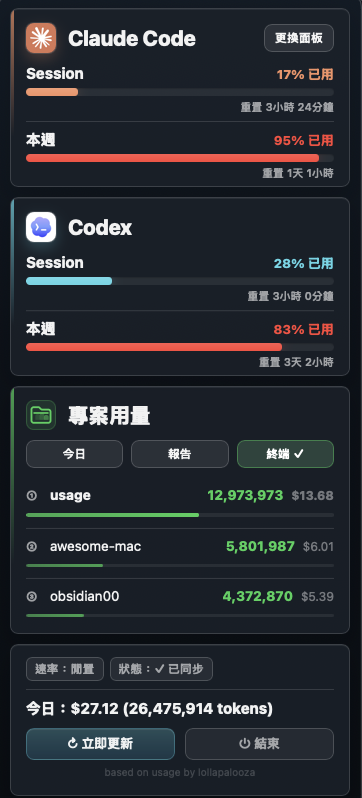

# usage

> Claude Code & Codex 用量監看器 —— 把配額釘在 macOS 選單列

繁體中文 · [English](README.en.md) &nbsp;|&nbsp; 💬 [Discussions](https://github.com/aqua5230/usage/discussions) &nbsp;|&nbsp; 🌐 [官方介紹頁](https://aqua5230.github.io/usage/)

[](https://github.com/aqua5230/usage/actions/workflows/check.yml)
[](https://github.com/aqua5230/usage/releases/latest)
[](https://www.python.org/)
[](https://www.apple.com/macos/)
[](LICENSE)

<p align="center">
  
</p>

`usage` 是一個 macOS menu bar（螢幕右上角的選單列）小工具，把 **Claude Code 跟 Codex** 的用量釘在你的螢幕右上角。點開可以看到 Session、Weekly、各專案用量（今日 / 7 日 / 月），以及今日 token 用量與成本估算。

用量數字全部來自 Claude Code 跟 Codex 在你本機留下的檔案——**不呼叫 Anthropic / OpenAI 的 API、不讀 Keychain（macOS 內建的密碼保險箱）**，所以不會發生「自己每分鐘 ping 一次也算用量」這種事。

## ✨ 主要功能

- **選單列用量監看** —— Claude Code 與 Codex 的配額常駐右上角，數字跟進度條同色，掃一眼就知道警示級別。點開看更細。
- **進度管家** —— 開新 Claude Code 對話自動接回上次進度，不用再重講一次。純本地、零 API，預設關閉。[詳見介紹](https://aqua5230.github.io/usage/#resume)。
- **9 款視覺面板** —— 從簡潔白卡到世界盃轉播 HUD，一鍵切換主題。
- **HTML 深度報告** —— token 與成本走勢、各專案排名，可一鍵分享給同事。
- **5 語言介面** —— 繁中、簡中、英、日、韓，自動跟隨系統語言。

## 📦 安裝

### Homebrew（推薦）

一鍵裝好、日後 `brew upgrade` 自動更新：

```bash
brew tap aqua5230/homebrew-usage
brew install aqua5230/homebrew-usage/usage
```

裝完後在 Finder 找到 `usage.app`（位於 `/opt/homebrew/Cellar/usage/` 底下），按住 Ctrl 右鍵 → 打開，讓 macOS 放行一次。之後可連結到 Applications：

```bash
ln -s $(brew --prefix)/Cellar/usage/$(brew list --versions usage | awk '{print $2}')/usage.app /Applications/usage.app
```

### 下載現成 App

到 [GitHub Releases 頁面](https://github.com/aqua5230/usage/releases/latest) 下載最新的 `usage.app.zip`，解壓縮後把 `usage.app` 拖到任何地方（例如 `/Applications`）就能跑。

⚠️ 因為沒有 Apple Developer 簽章，**第一次開啟時 macOS Gatekeeper（系統的「擋陌生程式」保全機制）會擋下來**。解法：在 Finder 找到 `usage.app` → 按住 Ctrl 點右鍵 → 選「打開」→ 再確認一次「打開」。之後就能直接雙擊。

### 首次打開：設定狀態列

第一次打開 usage，如果你用過 Codex，Codex 區塊通常會直接讀取 `~/.codex/sessions` 並顯示。若你使用 Claude Code，popover 可能會顯示**「設定狀態列」按鈕**——點一下即可裝好 hook（事件觸發點，每次刷新狀態列自動跑的小程式）。

設定後請重開相關工具：Codex 需重新開啟一次；如果設定了 Claude Code，請完全結束（Cmd+Q）再重開一次，數字才會落到磁碟。

設定完成後，Claude Code 視窗底部會出現這樣的狀態列——**5 小時 / 7 天配額條、對話窗用量、會話時長、目前模型，全擠在一行**：

<p align="center">
  
</p>

之後想隨時關掉 / 重裝狀態列（例如想看 Claude Code 原本的狀態列），可從 menubar popover 的「專案」section 工具列點 **CLI ✓** 按鈕一鍵切換。

> 從原始碼執行、或想用指令模式安裝？見 [開發文件](docs/DEVELOPMENT.md)。

## 跟其他工具比較

| 功能 | usage | ccusage | TokenTracker |
|------|:-----:|:-------:|:------------:|
| macOS menu bar | ✅ | — | ✅ |
| Claude Code 用量 | ✅ | ✅ | ✅ |
| Codex 用量 | ✅ | — | ✅ |
| HTML 深度報告 | ✅ | ✅ | — |
| 5 語言 i18n | ✅ | — | — |
| 視覺面板 9 款 | ✅ | — | — |
| 進度管家（session 接續） | ✅ | — | — |
| 零 API 呼叫 | ✅ | ✅ | ✅ |
| 開源授權 | AGPL-3.0 | MIT | — |

## 你需要的東西

- macOS
- 已經使用過 Claude Code 或 Codex 其中之一，讓它們在本機留下用量資料
- （從原始碼跑才需要）Python 3.13

## 常見問題排查

下面的「解法」欄會分三種使用者寫，先對一下你屬於哪一種：

- **.app 使用者** —— 從 GitHub Releases 下載 `usage.app.zip`、解壓後拖到 `/Applications`，像一般 Mac 軟體那樣雙擊圖示用的。不用碰 Terminal、不用裝 Python。
- **LaunchAgent 使用者** —— git clone 原始碼後，跑過 `./scripts/install-launchagent.sh` 讓 macOS 幫你開機自動啟動的。
- **原始碼使用者** —— git clone 原始碼後，每次自己在 Terminal 跑 `python3 main.py` 的。

| 症狀 | 原因 | 解法 |
|------|------|------|
| menu bar 顯示 `--` | 還沒有 Codex rate_limits，或 Claude Code hook 還沒刷新 | 先用 Codex 跑一次對話；若要接 Claude Code，**.app 使用者**點「設定狀態列」，**原始碼使用者**跑 `python3 main.py --setup` |
| 不小心按「結束」、腳印從選單列消失 | 「結束」會把整個 usage 程式關掉，要手動再開 | **.app 使用者**：按 `Cmd+Space` 叫出 Spotlight、輸入 `usage` 雙擊；或從 `/Applications` 找到 `usage.app` 雙擊。**LaunchAgent 使用者**：在 Terminal 跑 `launchctl start com.lollapalooza.usage`。**從原始碼跑的**：在 Terminal 再跑一次 `python3 main.py` |
| 狀態顯示「N 分鐘未更新」 | Claude Code 沒在跑，沒有刷新 statusLine | 打開 Claude Code 跑一下，它刷新時會自動更新 |
| Codex 那塊空白或不顯示 | `~/.codex/sessions/` 不存在，或還沒有含 rate_limits 的 token_count 事件 | 用 Codex 跑一次對話，等它寫入紀錄 |
| 今日花費是 $0.00 | 模型名稱對不上 pricing 表，或 pricing 下載 / 快取失敗 | 刪掉 `~/.claude/pricing_cache.json` 讓它重新抓；或設 `USAGE_DEBUG=1` 看錯誤訊息 |
| app 雙擊打不開 | macOS Gatekeeper 擋住未簽章的 app | Finder → 找到 `usage.app` → 按住 Ctrl 右鍵 → 打開 → 確認打開 |
| app 一打開就閃退（macOS Sequoia / arm64） | 你裝的是 v0.10.x 或 v0.11.0，這幾版有 py2app 打包 bug | 升級到 **v0.11.1 或更新**，到 [Releases](https://github.com/aqua5230/usage/releases/latest) 重新下載 `usage.app.zip` |

上面表格沒解決你的問題？確定是 bug 就開 [Issue](https://github.com/aqua5230/usage/issues)；只是想問問題、分享想法或聊聊用法，到 [Discussions](https://github.com/aqua5230/usage/discussions)。

## 從原始碼跑 / 開發

想從原始碼執行、跑 TUI / CLI 報告、設定可偵測的 agent、或自己打包 `.app`，完整說明都在 **[開發文件 docs/DEVELOPMENT.md](docs/DEVELOPMENT.md)**，內容包含：

- 它怎麼拿到你的用量數字（Claude Code hook 流程、Codex 紀錄解析、讀檔優先序）
- 建環境、設定可偵測 agent、Menu bar / TUI 執行方式
- 報告與深度分析 CLI、開機自動啟動、預覽模式、全部參數、除錯、語言切換
- 打包成 `.app`

## 授權

採用 AGPL-3.0-only（見頂部 badge 與 [LICENSE](LICENSE)）。若 fork 或發佈衍生版本，請標注原作者與專案連結：https://github.com/aqua5230/usage

## 支持這個專案

如果 usage 幫你避開了 quota（API 配額）耗盡的中斷，請點 ⭐ —— 讓更多人找到它。

如果這個工具幫到你、歡迎請我喝杯咖啡 ☕
