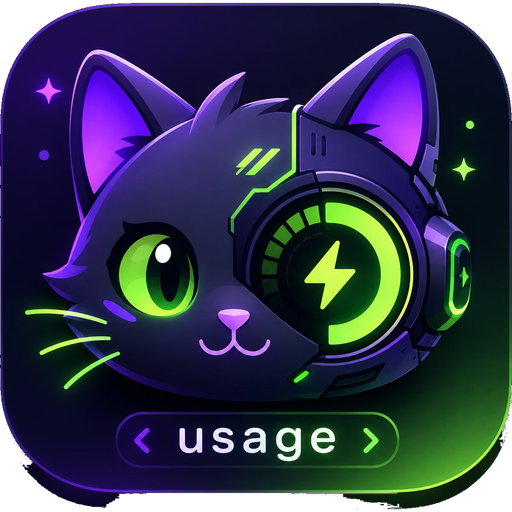
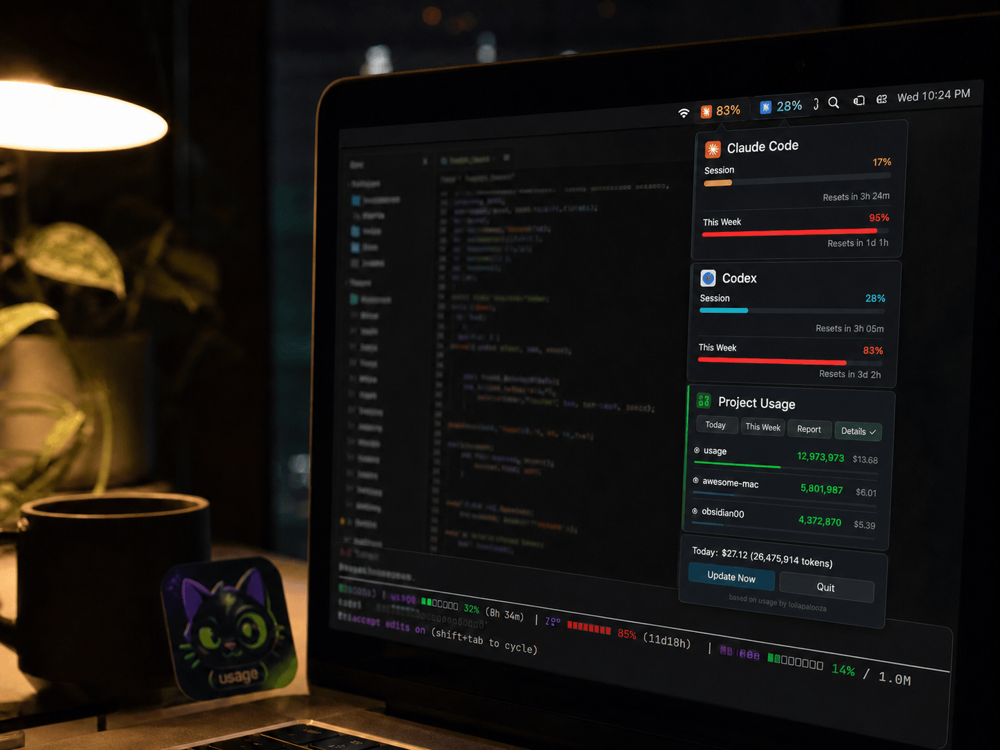
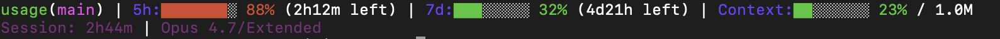
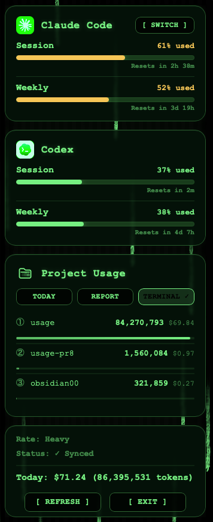
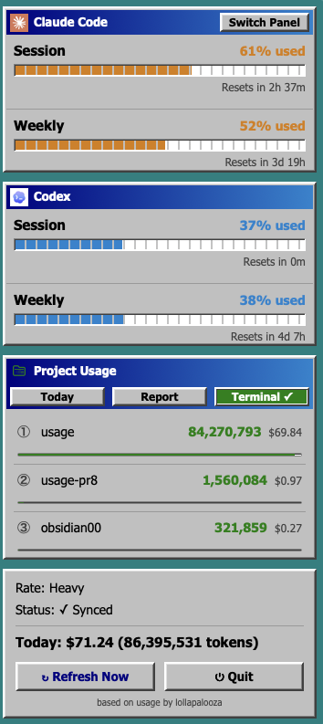
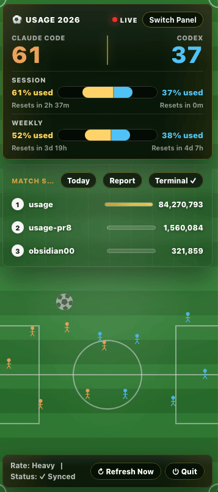
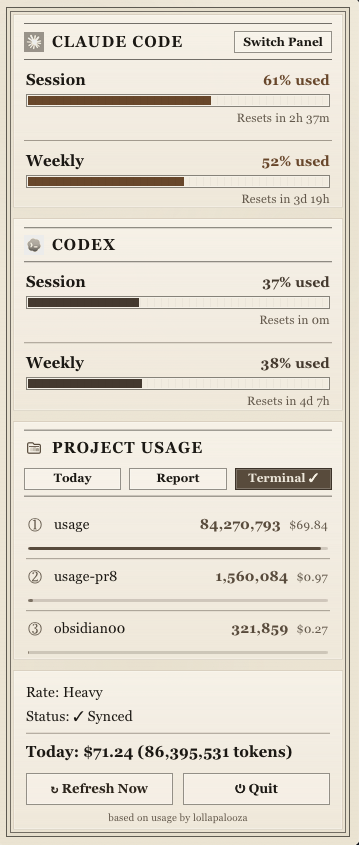
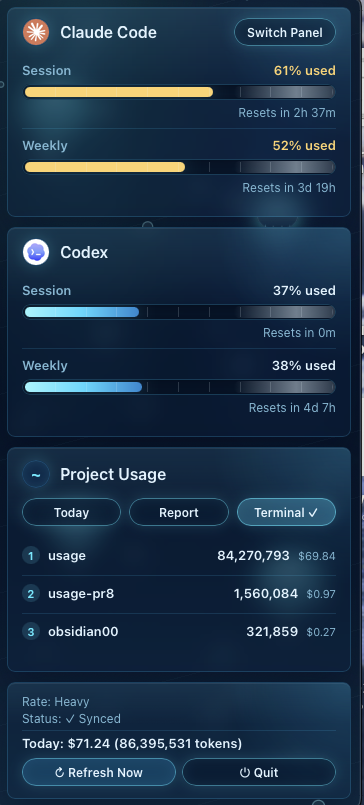
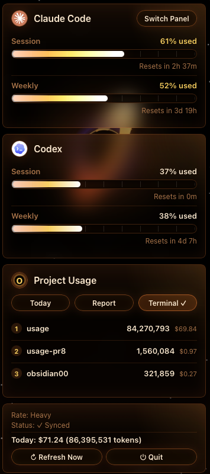

<p align="center">
  
</p>

# usage

### Your quota, where your eyes already are.

Claude Code & Codex usage, always in the macOS menu bar. A command tells you *when you ask* — usage tells you *without being asked*.

[繁體中文](README.zh-TW.md) · English &nbsp;|&nbsp; 💬 [Discussions](https://github.com/aqua5230/usage/discussions) &nbsp;|&nbsp; 🌐 [Landing page](https://aqua5230.github.io/usage/)

[](https://github.com/aqua5230/usage/actions/workflows/check.yml)
[](https://github.com/aqua5230/usage/releases/latest)
[](https://www.python.org/)
[](https://www.apple.com/macos/)
[](LICENSE)

<p align="center">
  
</p>

`usage` keeps your **Claude Code and Codex** quota pinned to the top-right of your screen, color-coded so the warning level reads at a glance. One click opens Session, Weekly, per-project usage (today / 7-day / monthly), and today's token cost. Every number is read from local files Claude Code and Codex already write — it **never calls the Anthropic / OpenAI API** and **never reads the Keychain**, so the monitor itself never adds to your usage.

## Sound familiar?

- 🧱 **You're deep in a refactor and Claude Code just… stops.** Out of quota, no heads-up — now you're blocked and you didn't even see it coming.
- ❓ **No idea how much of your 5-hour or weekly limit is left.** You're flying blind until you hit the wall.
- 🔁 **A CLI answers — but only when you stop and run it.** usage never makes you ask; the number's already in the corner of your eye.

usage answers all three at a glance: the number is *already on your screen*, color-coded, updated passively from local logs — no command to run, no page to open.

## 🚀 Quick Start

```bash
brew install --cask aqua5230/usage/usage
```

It lands in your Applications folder automatically → right-click **Open** once (to pass Gatekeeper) → click the menu bar icons. Prefer a direct download, or want every detail? See [Install](#-install) below.

## ✨ What you get

- **See it without looking for it.** Your quota lives in the menu bar, color-coded — green to red — so the warning level reads in a glance, no click required. Click only when you want the full breakdown.
- **Never re-explain your progress again.** Open a new Claude Code session and usage hands your last progress straight to the AI — no `/resume`, no recap, and no dragging a bloated old conversation back just to continue. Fully local, off by default. [Learn more](https://aqua5230.github.io/usage/#resume).
- **Find out where your tokens leak — without asking.** A daily background health check scans your local session logs for avoidable waste — the same files read over and over, bloated sessions, oversized command output. When it finds something worth fixing, the new-conversation handoff above gains a one-line heads-up; say "show me" and the AI walks you through the findings and how to fix them. Ships with the Progress Concierge, fully local.
- **Summon a tiny spirit that runs with your burn rate.** A menu-bar toggle adds a small white silhouette beside your usage percentages — phoenix for Claude, dragon for Codex. It speeds up as your local token burn climbs, stays fully local, and is off by default.
- **Warned before the wall, not at it.** A system notification when you're nearing a threshold, run out, or recover — so you wrap up on your terms instead of getting cut off mid-sentence. Fully local, off by default.
- **Know where your tokens actually go.** HTML deep reports with token & cost trends and per-project rankings — shareable with your team. The report also digests recent updates to Claude Code, Codex, and Antigravity in plain language, and gives you a year in review: a GitHub-style contribution heatmap of your daily token activity plus a "Wrapped" card crowned with the spirit you used most.
- **Make it yours.** 10 switchable panel themes, from a clean light card to a World Cup broadcast HUD. Only use one of Claude Code / Codex? Hide the other from the menu bar and every panel with a single toggle.
- **In your language, automatically.** UI in Traditional Chinese, Simplified Chinese, English, Japanese, and Korean, following your system setting.

## 🔒 Privacy & data sources

- Usage numbers are read only from the local log files Claude Code / Codex leave on your machine — it **never calls the Anthropic / OpenAI API and never reads the Keychain** (macOS's built-in password vault).
- The only two times it goes online: fetching a public model-pricing table to estimate cost (falls back to built-in prices if that fails), and occasionally checking GitHub for a new version. Neither involves your usage data, and nothing is ever uploaded.

## Requirements

- macOS
- Claude Code or Codex has been used at least once so local usage data exists
- (Only if running from source) Python 3.13

## 📦 Install

Two ways to install — pick whichever suits you. Steps for both are below. (In a hurry? The one-line Homebrew install is in [Quick Start](#-quick-start) above.)

### Download the app

1. Download the latest `usage.app.zip` from the [GitHub Releases page](https://github.com/aqua5230/usage/releases/latest)
2. Unzip it and drag `usage.app` into your Applications folder (or anywhere you like)
3. First launch: in Finder, right-click `usage.app` → **Open** → confirm Open
4. Click the usage icons in the top-right menu bar to see your usage

⚠️ Step 3 is needed because the app isn't signed with an Apple Developer certificate, so **macOS Gatekeeper (the built-in feature that blocks unfamiliar programs) blocks the first launch**; once you right-click → Open to allow it once, double-clicking works normally afterward.

### Homebrew

Installing via Homebrew (the macOS package manager) means a single `brew upgrade --cask usage` keeps it current. It's shipped as a **cask** (Homebrew's format for GUI apps), so it drops `usage.app` straight into your Applications folder — no manual move needed. The [Quick Start](#-quick-start) one-liner above already installs it — that command's full path auto-adds the tap for you, so one line is all you need. Prefer to run the two steps explicitly?

```bash
brew tap aqua5230/homebrew-usage
brew install --cask aqua5230/usage/usage
```

> Upgrading from an older release that installed via a formula? Run `brew uninstall usage` once, then the cask command above.

Same first-launch right-click → **Open** as above (to pass Gatekeeper).

### First launch: set up the status line

The first time you open usage, if you've already used Codex, it automatically picks up your Codex history and shows it — no setup needed. If you use Claude Code, the popover (the small window that pops up when you click the icon) may show a **"Set Up Status Line"** button — click it to install the hook (a small script that runs every time Claude Code refreshes its status line) that syncs your usage to the menu bar.

Restart the relevant tool afterward: restart Codex once; if Claude Code was configured too, fully quit Claude Code (Cmd+Q) and re-open it so the data lands on disk.

**Then you'll see:**

- The Claude / Codex usage icons and percentages in the top-right menu bar
- Click it for the Claude Code / Codex usage cards
- If it shows `--`, it's usually not broken — there's just no local usage data yet: Codex needs one conversation first, and Claude Code needs the status line set up plus a full restart

Once set up, the bottom of the Claude Code window will show a status line like this — **5h / 7d quota bars, context usage, session duration, current model — all on one line**:

<p align="center">
  
</p>

To toggle the status line on / off later (e.g. you want to see Claude Code's native status line), click the **CLI ✓** button in the menubar popover's "Projects" section toolbar.

> Running from source, or want to install via the command line? See the [development docs](docs/DEVELOPMENT.md).

## Troubleshooting

The "Fix" column distinguishes three kinds of users — find yours first:

- **.app users** — downloaded `usage.app.zip` from GitHub Releases, unzipped, dragged `usage.app` to `/Applications`, double-click to launch like any Mac app. No Terminal, no Python.
- **LaunchAgent users** — cloned the source and ran `./scripts/install-launchagent.sh` so macOS auto-starts usage on login.
- **Source users** — cloned the source and run `python3 main.py` manually in Terminal each time.

> Seeing `--`? Don't reinstall just yet — in the vast majority of cases there's simply no local usage data yet, and it appears after one conversation.

| Symptom | Likely cause | Fix |
|---------|--------------|-----|
| Menu bar shows `--` | No Codex `rate_limits` yet, or the Claude Code hook has not refreshed | Run one Codex conversation first. For Claude Code integration, **.app users** click "Set Up Status Line"; **Source users** run `python3 main.py --setup` |
| Accidentally hit "Quit", usage icons disappeared from the menu bar | "Quit" fully terminates the usage process; you have to relaunch it | **.app users**: press `Cmd+Space` for Spotlight, type `usage`, hit Enter; or double-click `usage.app` from `/Applications`. **LaunchAgent users**: run `launchctl start com.lollapalooza.usage` in Terminal. **Source users**: run `python3 main.py` in Terminal again |
| Status says "N minutes stale" | Claude Code isn't running | Open Claude Code and let it run; it updates the file on its next status refresh |
| Codex section is empty | `~/.codex/sessions/` doesn't exist or has no `rate_limits` events yet | Run a Codex conversation to generate log entries |
| Today's cost shows $0.00 | Model name doesn't match the pricing table, or pricing download/cache failed | Delete `~/.claude/pricing_cache.json` to force a re-fetch; or run with `USAGE_DEBUG=1` for details |
| App won't open (blocked by macOS) | Gatekeeper blocks unsigned apps | Finder → find `usage.app` → right-click → Open → confirm Open |
| App crashes immediately on launch (macOS Sequoia / arm64) | You're on v0.10.x or v0.11.0 — these had a py2app bundling bug | Upgrade to **v0.11.1 or newer** by downloading `usage.app.zip` from [Releases](https://github.com/aqua5230/usage/releases/latest) |

Table didn't solve it? If it's clearly a bug, open an [Issue](https://github.com/aqua5230/usage/issues); for questions, ideas, or general usage chat, head to [Discussions](https://github.com/aqua5230/usage/discussions).

## 🎨 Panel themes

The click-to-open popover ships with **10 switchable visual themes** — from a clean classic card to Matrix digital rain, a Windows 95 window, a World Cup broadcast HUD, or a cyanotype blueprint plate:

<p align="center">
  
  
  
  
  
  
</p>

See more on the [landing page](https://aqua5230.github.io/usage/#screenshots).

## Comparison

| Feature | usage | ccusage | TokenTracker |
|---------|:-----:|:-------:|:------------:|
| Always on screen — no command to run | ✅ | — | ✅ |
| macOS menu bar | ✅ | — | ✅ |
| Claude Code usage | ✅ | ✅ | ✅ |
| Codex usage | ✅ | — | ✅ |
| HTML deep reports | ✅ | ✅ | — |
| 5-language i18n | ✅ | — | — |
| 10 visual panel themes | ✅ | — | — |
| Progress Concierge (session resume) | ✅ | — | — |
| Token-waste health check | ✅ | — | — |
| Year-in-review (contribution graph + Wrapped) | ✅ | — | — |
| Zero API calls | ✅ | ✅ | ✅ |
| Open-source license | AGPL-3.0 | MIT | — |

## Run from source / develop

To run from source, use the TUI / CLI reports, configure detected agents, or build the `.app` yourself, see the **[development docs (docs/DEVELOPMENT.md)](docs/DEVELOPMENT.md)**, which cover:

- How usage gets your data (Claude Code hook flow, Codex log parsing, read priority)
- Environment setup, configuring detected agents, Menu bar / TUI run modes
- Reports & deep analytics CLI, auto-start on login, preview mode, all options, debug, language switching
- Building a `.app` bundle

## License

Licensed under AGPL-3.0-only (see the badge at the top and [LICENSE](LICENSE)). If you fork or redistribute a modified version, please credit the original author and link to:
https://github.com/aqua5230/usage

## Star History

<a href="https://star-history.com/#aqua5230/usage&Date">
  
</a>

## Support

If usage has ever saved you from a surprise quota cutoff mid-task, a ⭐ helps other developers find it.

If this tool helps you, consider buying me a coffee ☕

[](https://ko-fi.com/lollapalooza)
