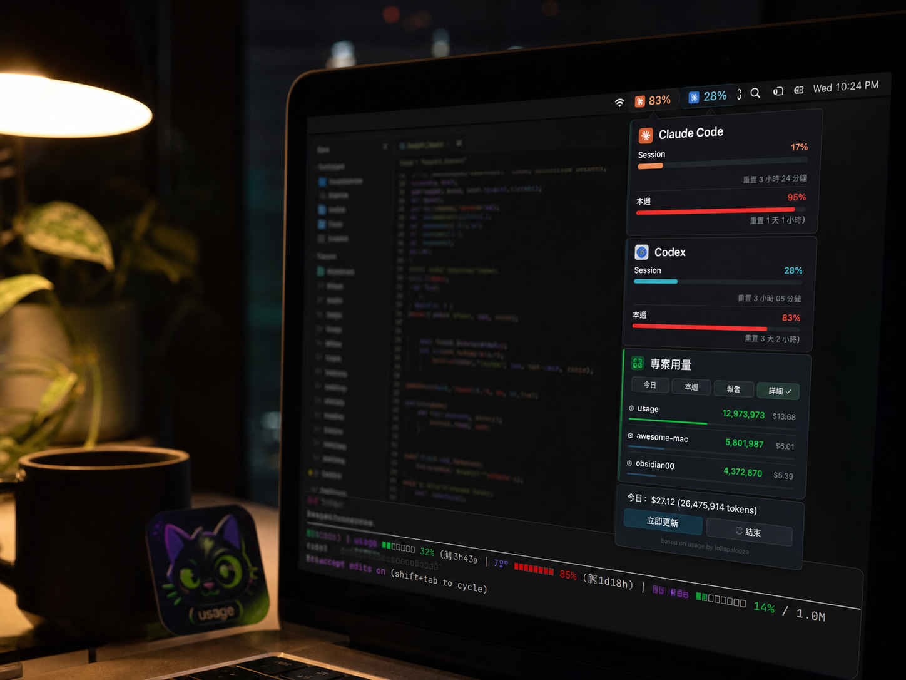
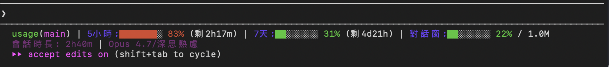
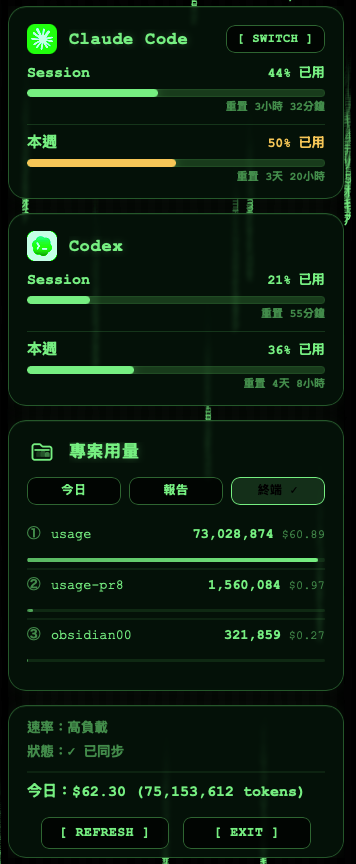
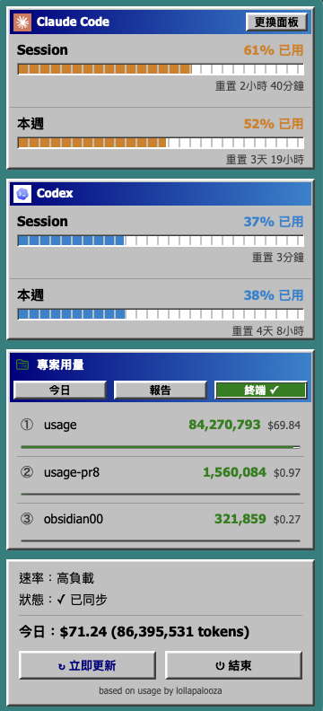
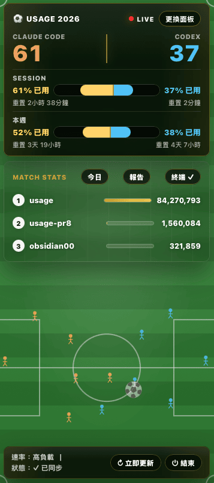
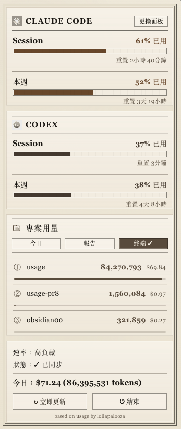
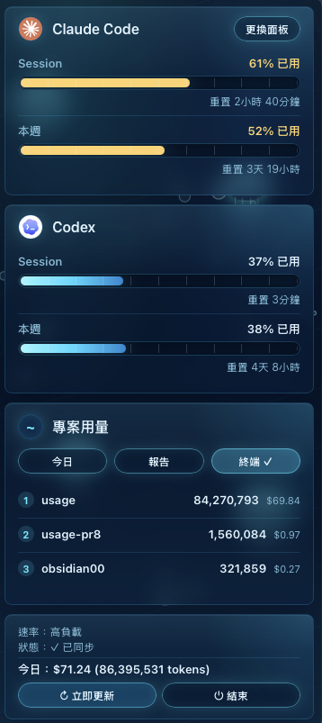
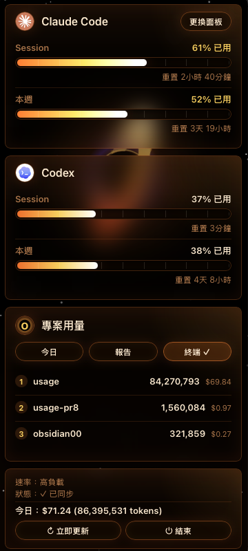

<p align="center">
  
</p>

# usage

### 額度，就放在你眼睛已經在看的地方

Claude Code 與 Codex 用量，常駐 macOS 選單列。指令是你**問了才答**；usage 是你**不用問它就在**。

繁體中文 · [English](README.md) &nbsp;|&nbsp; 💬 [Discussions](https://github.com/aqua5230/usage/discussions) &nbsp;|&nbsp; 🌐 [官方介紹頁](https://aqua5230.github.io/usage/)

[](https://github.com/aqua5230/usage/actions/workflows/check.yml)
[](https://github.com/aqua5230/usage/releases/latest)
[](https://www.python.org/)
[](https://www.apple.com/macos/)
[](LICENSE)

<p align="center">
  
</p>

`usage` 把 **Claude Code 跟 Codex** 的額度釘在螢幕右上角的選單列，用顏色標好警戒級別，掃一眼就懂。點一下打開 Session、Weekly、各專案用量（今日 / 7 日 / 月）與今日 token 成本。每個數字都讀自 Claude Code 跟 Codex 本機已經在寫的檔案——**不呼叫 Anthropic / OpenAI 的 API、不讀 Keychain（macOS 內建的密碼保險箱）**，所以這個監看器本身永遠不會增加你的用量。

## 是不是很熟悉？

- 🧱 **重構做到一半，Claude Code 突然不動了。** 額度用完、毫無預警——你被卡住，還完全沒看到它要來。
- ❓ **完全不知道 5 小時或每週額度還剩多少。** 撞牆前都在盲飛。
- 🔁 **指令會回答你——但只在你停下來敲它的那一刻。** usage 不用你問，數字一直在你眼角。

usage 一眼就解決三個：數字*早就在你螢幕上*、用顏色標好警戒級別、從本機紀錄被動更新——不用跑指令、不用開網頁。

## 🚀 快速上手

```bash
brew install --cask aqua5230/usage/usage
```

它會自動放進你的「應用程式」資料夾 → 右鍵「打開」一次（讓 Gatekeeper 放行）→ 點選單列圖示。想用直接下載、或想看完整細節？見下方 [安裝](#-安裝)。

## ✨ 你會得到什麼

- **不用找它，它就在眼前。** 額度常駐選單列，用顏色標警戒級別——綠到紅，瞄一眼就懂，不用點。想看細節再點開。
- **再也不用重講一遍進度。** 開新的 Claude Code 對話，usage 直接把你上次的進度交給 AI——不用 `/resume`、不用重講，也不用把又長又雜的舊對話整串拖回來才能接續。完全本機、預設關閉。[了解更多](https://aqua5230.github.io/usage/#resume)。
- **token 漏在哪，它主動告訴你。** 每天在背景對本機的工作階段紀錄做一次健檢，找出可避免的浪費——同一批檔案反覆重讀、對話異常膨脹、指令輸出過大。發現值得處理的問題時，上面那段開新對話的交接開場白會多一行提醒；說「看」，AI 就會解釋發現了什麼、該怎麼改。跟進度管家一起提供，完全本機。
- **召喚一隻會跟著燃燒率跑步的小神獸。** 打開選單列裡的開關，就會在用量百分比旁邊多一隻白色剪影——Claude 是鳳凰，Codex 是肥龍。token 燒越快牠跑越快，完全本機、預設關閉。
- **在撞牆前被提醒，不是撞上才知道。** 接近門檻、用完、或恢復時跳系統通知——讓你照自己的節奏收尾，而不是話講一半被切斷。完全本機、預設關閉。
- **看清你的 token 到底花在哪。** HTML 深度報告：token 與成本趨勢、各專案排名，可分享給團隊。報告也會用白話幫你整理 Claude Code、Codex、Antigravity 的近期更新，並給你一份年度回顧：GitHub 風格的每日 token 貢獻熱力圖，加一張以你最常用神獸加冕的「年度回顧」卡。
- **做成你的樣子。** 10 種可切換面板主題，從乾淨的淺色卡片到世界盃轉播 HUD。只用 Claude Code 或 Codex 其中一套？一個開關就能把另一套從選單列和所有面板整個藏起來。
- **自動講你的語言。** 介面支援繁中、簡中、英、日、韓，跟著系統語言走。

## 🔒 隱私與資料來源

- 用量數字只讀 Claude Code / Codex 留在你本機的紀錄檔——**不呼叫 Anthropic / OpenAI 的 API、不讀 Keychain（macOS 內建的密碼保險箱）**。
- 唯二會連網的地方：抓一份公開的模型價格表來估算成本（抓不到就用內建價格），以及偶爾跟 GitHub 確認有沒有新版本。兩者都跟你的用量資料無關，也不會把任何東西上傳出去。

## 你需要的東西

- macOS
- 已經使用過 Claude Code 或 Codex 其中之一，讓它們在本機留下用量資料
- （從原始碼跑才需要）Python 3.13

## 📦 安裝

兩種安裝方式，挑一個順手的用，步驟都在下面。（趕時間？一行 Homebrew 安裝在上方 [快速上手](#-快速上手)。）

### 下載現成 App

1. 到 [GitHub Releases 頁面](https://github.com/aqua5230/usage/releases/latest) 下載最新的 `usage.app.zip`
2. 解壓縮，把 `usage.app` 拖到「應用程式」資料夾（或任何地方）
3. 第一次開啟：在 Finder 按住 Ctrl 點右鍵 → 選「打開」→ 再確認一次「打開」
4. 點右上角選單列的用量圖示，就能看到用量

⚠️ 第 3 步是因為這個 app 沒有 Apple Developer 簽章，**macOS Gatekeeper（系統內建、用來擋陌生程式的保全機制）會擋第一次開啟**；右鍵「打開」放行一次之後，以後直接雙擊就行。

### Homebrew

用 Homebrew（macOS 的套件管理工具）裝，好處是日後一行 `brew upgrade --cask usage` 就能自動更新。它以 **cask**（Homebrew 給 GUI 應用程式用的格式）發佈，所以會直接把 `usage.app` 放進「應用程式」資料夾，不用手動搬。上方 [快速上手](#-快速上手) 那一行其實就裝好了——那串指令的完整路徑會自動幫你加 tap，所以一行就夠。想看清楚拆成兩步的話：

```bash
brew tap aqua5230/homebrew-usage
brew install --cask aqua5230/usage/usage
```

> 之前用舊版（formula）裝過的人升級：先跑一次 `brew uninstall usage`，再用上面的 cask 指令重裝。

第一次開啟同上：按住 Ctrl 右鍵 →「打開」讓 macOS 放行一次。

### 首次打開：設定狀態列

第一次打開 usage，如果你用過 Codex，它會自動讀到你的 Codex 使用紀錄並顯示，不用手動設定。若你使用 Claude Code，popover（點圖示後彈出的小視窗）可能會顯示**「設定狀態列」按鈕**——點一下即可裝好 hook（每次 Claude Code 刷新狀態列時自動跑一次的小程式），把用量同步到選單列。

設定後請重開相關工具：Codex 需重新開啟一次；如果設定了 Claude Code，請完全結束（Cmd+Q）再重開一次，數字才會落到磁碟。

**接著你會看到：**

- 選單列右上角出現 Claude／Codex 用量圖示和百分比
- 點開是 Claude Code / Codex 的用量卡片
- 若顯示 `--`，多半不是壞掉，而是還沒有本機用量資料：Codex 要先跑過一次對話，Claude Code 要設定狀態列並完全重開

設定完成後，Claude Code 視窗底部會出現這樣的狀態列——**5 小時 / 7 天配額條、對話窗用量、會話時長、目前模型，全擠在一行**：

<p align="center">
  
</p>

之後想隨時關掉 / 重裝狀態列（例如想看 Claude Code 原本的狀態列），可從 menubar popover 的「專案」section 工具列點 **CLI ✓** 按鈕一鍵切換。

> 從原始碼執行、或想用指令模式安裝？見 [開發文件](docs/DEVELOPMENT.zh-TW.md)。

## 常見問題排查

下面的「解法」欄會分三種使用者寫，先對一下你屬於哪一種：

- **.app 使用者** —— 從 GitHub Releases 下載 `usage.app.zip`、解壓後拖到 `/Applications`，像一般 Mac 軟體那樣雙擊圖示用的。不用碰 Terminal、不用裝 Python。
- **LaunchAgent 使用者** —— git clone 原始碼後，跑過 `./scripts/install-launchagent.sh` 讓 macOS 幫你開機自動啟動的。
- **原始碼使用者** —— git clone 原始碼後，每次自己在 Terminal 跑 `python3 main.py` 的。

> 看到 `--` 先別急著重裝——絕大多數情況只是還沒有本機用量資料，跑一次對話就會出現。

| 症狀 | 原因 | 解法 |
|------|------|------|
| menu bar 顯示 `--` | 還沒有 Codex rate_limits，或 Claude Code hook 還沒刷新 | 先用 Codex 跑一次對話；若要接 Claude Code，**.app 使用者**點「設定狀態列」，**原始碼使用者**跑 `python3 main.py --setup` |
| 不小心按「結束」、用量圖示從選單列消失 | 「結束」會把整個 usage 程式關掉，要手動再開 | **.app 使用者**：按 `Cmd+Space` 叫出 Spotlight、輸入 `usage` 雙擊；或從 `/Applications` 找到 `usage.app` 雙擊。**LaunchAgent 使用者**：在 Terminal 跑 `launchctl start com.lollapalooza.usage`。**從原始碼跑的**：在 Terminal 再跑一次 `python3 main.py` |
| 狀態顯示「N 分鐘未更新」 | Claude Code 沒在跑，沒有刷新 statusLine | 打開 Claude Code 跑一下，它刷新時會自動更新 |
| Codex 那塊空白或不顯示 | `~/.codex/sessions/` 不存在，或還沒有含 rate_limits 的 token_count 事件 | 用 Codex 跑一次對話，等它寫入紀錄 |
| 今日花費是 $0.00 | 模型名稱對不上 pricing 表，或 pricing 下載 / 快取失敗 | 刪掉 `~/.claude/pricing_cache.json` 讓它重新抓；或設 `USAGE_DEBUG=1` 看錯誤訊息 |
| app 雙擊打不開 | macOS Gatekeeper 擋住未簽章的 app | Finder → 找到 `usage.app` → 按住 Ctrl 右鍵 → 打開 → 確認打開 |
| app 一打開就閃退（macOS Sequoia / arm64） | 你裝的是 v0.10.x 或 v0.11.0，這幾版有 py2app 打包 bug | 升級到 **v0.11.1 或更新**，到 [Releases](https://github.com/aqua5230/usage/releases/latest) 重新下載 `usage.app.zip` |

上面表格沒解決你的問題？確定是 bug 就開 [Issue](https://github.com/aqua5230/usage/issues)；只是想問問題、分享想法或聊聊用法，到 [Discussions](https://github.com/aqua5230/usage/discussions)。

## 🎨 視覺面板主題

點開的彈窗內建 **10 款可切換的視覺主題**——從簡潔白卡，到 Matrix 數位雨、Windows 95 視窗、世界盃轉播 HUD、藍曬工程藍圖：

<p align="center">
  
  
  
  
  
  
</p>

更多面板樣貌見[官方介紹頁](https://aqua5230.github.io/usage/#screenshots)。

## 跟其他工具比較

| 功能 | usage | ccusage | TokenTracker |
|------|:-----:|:-------:|:------------:|
| 一直在螢幕上——不用敲指令 | ✅ | — | ✅ |
| macOS menu bar | ✅ | — | ✅ |
| Claude Code 用量 | ✅ | ✅ | ✅ |
| Codex 用量 | ✅ | — | ✅ |
| HTML 深度報告 | ✅ | ✅ | — |
| 5 語言 i18n | ✅ | — | — |
| 視覺面板 10 款 | ✅ | — | — |
| 進度管家（session 接續） | ✅ | — | — |
| token 浪費健檢 | ✅ | — | — |
| 年度回顧（貢獻熱力圖 + Wrapped） | ✅ | — | — |
| 零 API 呼叫 | ✅ | ✅ | ✅ |
| 開源授權 | AGPL-3.0 | MIT | — |

## 從原始碼跑 / 開發

想從原始碼執行、跑 TUI / CLI 報告、設定可偵測的 agent、或自己打包 `.app`，完整說明都在 **[開發文件 docs/DEVELOPMENT.zh-TW.md](docs/DEVELOPMENT.zh-TW.md)**，內容包含：

- 它怎麼拿到你的用量數字（Claude Code hook 流程、Codex 紀錄解析、讀檔優先序）
- 建環境、設定可偵測 agent、Menu bar / TUI 執行方式
- 報告與深度分析 CLI、開機自動啟動、預覽模式、全部參數、除錯、語言切換
- 打包成 `.app`

## 授權

採用 AGPL-3.0-only（見頂部 badge 與 [LICENSE](LICENSE)）。若 fork 或發佈衍生版本，請標注原作者與專案連結：https://github.com/aqua5230/usage

## Star 成長

<a href="https://star-history.com/#aqua5230/usage&Date">
  
</a>

## 支持這個專案

如果 usage 幫你避開了 quota（API 配額）耗盡的中斷，請點 ⭐ —— 讓更多人找到它。

如果這個工具幫到你、歡迎請我喝杯咖啡 ☕

[](https://ko-fi.com/lollapalooza)
