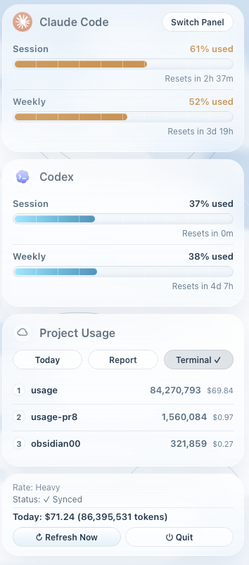
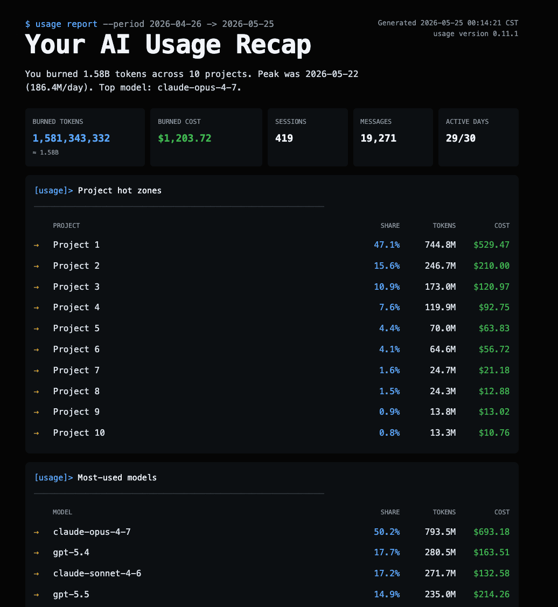

# Development

[Traditional Chinese](DEVELOPMENT.md) · English

Everything you need to run usage from source, use the TUI / CLI, configure detected agents, and build a `.app`. If you just want to install and use it, the [README](../README.md) is enough.

## How it gets the data

Usage numbers come from local files written by Claude Code and Codex — no Anthropic / OpenAI API calls. Network access is limited to two things: (1) to estimate Codex costs, usage needs a token pricing table — if no local cache exists (`~/.claude/pricing_cache.json`), usage shows the estimate immediately with a built-in fallback price, then tries to download and cache the public [LiteLLM pricing JSON](https://github.com/BerriAI/litellm) in the background, refreshing it again after 7 days. If the download fails, usage percentage display is unaffected, and pricing updates automatically once the network succeeds. (2) Starting in v0.11.0, usage pings the GitHub Releases API at most once per 24h to check for new versions (toggleable from the "Switch Panel" menu).

### Claude Code usage

usage installs a small **statusLine hook** — a script that Claude Code automatically pipes data into every time it refreshes its status line. The flow:

1. Claude Code refreshes the status line and packages usage info (5-hour percentage, 7-day percentage, etc.) as JSON.
2. It pipes that JSON to the hook via stdin.
3. The hook writes the JSON to `~/.claude/usage-status.json`.
4. The usage UI reads that file.

Since both sides look at the same source data, **the numbers match exactly what Claude Code itself shows**.

```mermaid
flowchart LR
    A[Claude Code main process] -->|pipes JSON to stdin<br/>on every statusLine refresh| B[usage-statusline.py<br/>hook script]
    B -->|writes| C[(~/.claude/<br/>usage-status.json)]
    D[usage menu bar / TUI] -->|reads| C
    D -->|renders| E[macOS menu bar]
    F((Anthropic API)) -.x.- D
    style F stroke:#c0392b,stroke-dasharray:5 5
```

Read priority:

1. `~/.claude/usage-status.json` — written by the hook usage installs.
2. `~/.claude/usag-status.json` — automatic v0.1.x legacy fallback; new users should not encounter this.
3. `~/.claude/tt-status.json` — fallback for users migrating from the third-party tool [stormzhang/token-tracker](https://github.com/stormzhang/token-tracker); usage will share its status file. (**Note: unrelated to this project's internal modules; it's purely external-community compat.**)

### Codex usage

Codex CLI doesn't expose a statusLine hook, so usage takes a different route: it scans the conversation logs Codex CLI leaves on disk (`~/.codex/sessions/*.jsonl`). Codex writes `rate_limits` data directly into each log entry — usage reads those fields to get the 5-hour and 7-day quota percentages directly. Today's token count and cost are summed from the token usage recorded in the same files.

Note that Codex only writes `rate_limits` into its logs **intermittently** — unlike Claude Code, it has no live status-line reporting — so this number can **lag your real usage** (and anything you do on the web never reaches the local files at all). When the local snapshot is older than 15 minutes, the Codex card shows an "about N minutes ago" tag to flag that it's stale. Staying offline is deliberate: it means usage never burns your tokens.

If Codex isn't installed or the directory doesn't exist, that part of the UI hides itself and Claude Code stats continue to work normally.

## Download

```bash
git clone https://github.com/aqua5230/usage.git
cd usage
```

If you don't use git, go to the [GitHub project page](https://github.com/aqua5230/usage), click the green **Code → Download ZIP**, then `cd` into the unzipped folder.

## Set up the environment

```bash
python3 -m venv .venv
source .venv/bin/activate
pip install -e .
```

This creates an isolated Python environment (`.venv`) for the project, activates it, and installs usage plus its dependencies into it.

## Set up detected agents

> Using the .app? Click the "Set Up Status Line" button in the popover on first launch instead. The steps below are for developers running usage from source.

This command configures detected agents: Codex gets `tui.status_line` in `~/.codex/config.toml`; if Claude Code is present, usage also copies the hook script into `~/.claude/` and updates Claude Code settings to point at it.

```bash
source .venv/bin/activate
python3 main.py --setup
```

**Restart Codex once after running this**. If Claude Code was configured, restart Claude Code too so it re-reads `~/.claude/settings.json` and refreshes its status line.

What `--setup` does in detail:

- Configures `tui.status_line` in `~/.codex/config.toml` when Codex is detected.
- If Claude Code is present, copies `usage_statusline.py` to `~/.claude/usage-statusline.py`.
- If Claude Code is present, points `statusLine` in `~/.claude/settings.json` at that hook.
- If you already had a custom Claude Code `statusLine`, it is backed up to `settings.usage.previousStatusLine` so nothing is overwritten.

To uninstall:

```bash
python3 main.py --unsetup
```

`--unsetup` restores the original Codex `status_line` and Claude Code `statusLine`, then removes the Claude hook and `~/.claude/usage-status.json`.

> **Fallback: install via curl**
> If the in-app "Set Up Status Line" button doesn't work or you prefer the command line, run the following in Terminal (download first, inspect, then run):
>
> ```bash
> curl -fsSL https://raw.githubusercontent.com/aqua5230/usage/main/scripts/install-hook.sh -o /tmp/usage-install.sh
> cat /tmp/usage-install.sh   # review the script before running
> bash /tmp/usage-install.sh
> ```

## Run modes

### Menu bar mode (default)

Stays in the macOS menu bar with a short percentage readout. Click it to open the full popover.

```bash
source .venv/bin/activate
python3 main.py
```

- **Menu bar format:** `🐾 37%`. If Codex usage is also detected, a Codex suffix is appended: `🐾 37% · 📜 10%`.

  

- **Click the icon to expand the popover.** It has four sections:
  1. Two cards for Claude Code and Codex. Each shows Session and Weekly progress bars with reset countdowns.
  2. A projects card listing the top three projects by usage. Click the button in the top-right corner to cycle between today / 7-day / monthly views.
  3. A footer card showing current rate, sync status, and today's token usage and cost estimate (Claude uses the actual `costUSD` from its log when available; Codex cost is estimated from token count × pricing table).
  4. Two buttons: "Refresh now" and "Quit".
- **Panel**: click the **Switch Panel** button in the top-right corner to change panel styles. Nine built-in panels are available — **Classic** (clean light cards), **Matrix** (neon green digital rain), **Windows 95** (retro Win95 interface), **Newspaper** (aged newsprint), **Cloud Observation** (weather-station glass cards), **Midnight Aquarium** (deep-sea animation), **Prism Arcade** (rainbow holographic animation), **Black Hole** (rotating accretion disk), and the brand-new **World Cup 2026** — FIFA broadcast HUD with a green pitch, stick-figure players that chase and kick the ball, and bidirectional duel bars instead of standard progress bars.

  <p align="center">
    
    &nbsp;&nbsp;
    
    &nbsp;&nbsp;
    
  </p>

  Your choice is persisted via `NSUserDefaults`, so the last selected panel survives restarts.
- **Update check (v0.11.0+)**: On launch, usage pings GitHub Releases for a newer version (rate-limited to once per 24h so you're not nagged every time you open the app). When a newer version is found, an alert shows the version + release notes with three buttons: **Download / Later / Skip this version**. The "Switch Panel" menu has **Automatically Check for Updates** (toggleable) and **Check for Updates Now** entries.
- **Permissions:** on first launch, macOS may ask whether to allow background execution. Click Allow.

### Terminal TUI mode

If you'd rather stay in a terminal, run the Rich Live TUI — everything draws inside your terminal window via repeated text repaints. You get a pixel-art Claude logo, a spinner, a rotating set of Claude Code's playful loading phrases, and the same two progress bars as the menu bar popover:

<p align="center">
  
</p>

```bash
source .venv/bin/activate
python3 main.py --tui
```

Press `Ctrl+C` to exit.

## Reports and deep analytics (CLI)

Beyond the menu bar and TUI, there's an analytics CLI entrypoint `usage_cli.py` for exporting HTML reports or running an interactive terminal dashboard:

<p align="center">
  
</p>

```bash
source .venv/bin/activate

# Interactive dashboard (auto-detects Claude / Codex; arrow keys switch between agents)
python3 usage_cli.py

# Single-agent dashboard
python3 usage_cli.py claude
python3 usage_cli.py codex

# Generate an HTML report and open it in your default browser (default range: last 30 days)
python3 usage_cli.py report
python3 usage_cli.py report --today              # today
python3 usage_cli.py report --week               # this week
python3 usage_cli.py report --month              # this month
python3 usage_cli.py report --all                # all data
python3 usage_cli.py report --out report.html    # save to a specific path

# Plain-text tabular stats
python3 usage_cli.py daily
python3 usage_cli.py weekly
python3 usage_cli.py monthly
```

The HTML report covers daily / weekly / monthly token + cost trends, per-project rankings, and top-model distribution. The top-right Share button lets you save a copy as `.html` or copy the file path to send via AirDrop / Mail / Slack / iMessage — recipients open it in any browser. The built-in "Hide project names" toggle (on by default, privacy-first) swaps every project name to `Project 1 / Project 2 / ...` before the file is saved, while the on-screen view is unaffected.

## Auto-start on login

A LaunchAgent (the macOS service that handles "what should start when this user logs in") makes usage start automatically.

**Easiest way:** click the menu bar icon to open the popover, press the "⇄ Switch Panel" button, and tick "Launch at Login" at the bottom of the menu. Works for both the .app and source builds — no Terminal needed.

The script below is an alternative install method for source users:

1. **Install:**
   ```bash
   ./scripts/install-launchagent.sh
   ```
   This drops a plist into `~/Library/LaunchAgents/` and loads usage immediately.

2. **Manual start (for testing):**
   ```bash
   launchctl start com.lollapalooza.usage
   ```

3. **Logs:**
   - stdout: `~/Library/Logs/usage/usage.log`
   - stderr: `~/Library/Logs/usage/usage.err.log`

4. **Uninstall:**
   ```bash
   ./scripts/uninstall-launchagent.sh
   ```

## Preview mode (no install required)

If you haven't installed the hook yet, or you just want to see what the UI looks like, run with fake data:

```bash
# Menu bar preview
python3 main.py --mock

# TUI preview
python3 main.py --tui --mock
```

## Options

- `--setup` / `--unsetup` — configure or restore detected agents (Codex `status_line`; Claude Code `statusLine` hook).
- `--tui` — force terminal TUI mode (no menu bar).
- `--interval N` — how often (seconds) the UI re-reads the status file. Minimum 30, default 60.
- `--mock` — use fake data; don't read any status file.
- `--force-group {0,1,2,3}` — force a specific rate group (TUI only).

## Debug

To see internal warnings (e.g. swallowed `OSError`s), set:

```bash
USAGE_DEBUG=1 python3 main.py
```

## Language

usage auto-detects the macOS system language. Supported languages:

| System language | Display |
|----------------|---------|
| Traditional Chinese | 繁體中文 |
| Simplified Chinese | 简体中文 |
| Japanese | 日本語 |
| Korean | 한국어 |
| Any other | English |

To force a specific language during development or testing:

```bash
USAGE_LANG=en python3 main.py      # English
USAGE_LANG=ja python3 main.py      # Japanese
USAGE_LANG=ko python3 main.py      # Korean
USAGE_LANG=zh-CN python3 main.py   # Simplified Chinese
```

## Behaviour notes

- usage only reads `~/.claude/usage-status.json`, the v0.1.x legacy `~/.claude/usag-status.json`, `~/.claude/tt-status.json`, and Codex's session files. It does not call the Anthropic / OpenAI API and does not read the Keychain. Network activity is limited to two things: (a) a one-time download of the LiteLLM pricing table for Codex cost estimates (cached for 7 days; offline fallback available); (b) starting in v0.11.0, an at-most-daily ping to the GitHub Releases API to check for new versions (toggleable from the "Switch Panel" menu).
- When Claude Code isn't running, the status file isn't updated — but actual usage isn't changing either (until reset time), so the displayed value is still accurate. After reset time passes, it auto-resets to zero.
- If the status file hasn't been updated for more than 6 hours, the status message shows `⚠ usage stale Nm` (where N is the actual minute count) to flag potentially out-of-date numbers.

## Build a .app bundle (optional)

If you want to launch usage by double-clicking instead of opening a terminal, build a native macOS app bundle:

```bash
./scripts/build_app.sh
```

The output is `dist/usage.app`. Double-click it or run `open dist/usage.app`.

> **Build environment**: Please use `uv` (not conda Python) when building the `.app` locally. Conda bundles its own `libffi` / `libsqlite3` that py2app does not auto-include, which causes the resulting `.app` to crash on startup. CI builds use `uv` and are tested.

Each GitHub Release build (push a `v*` tag) automatically builds the app in CI and attaches `usage.app.zip` to the Release page.
