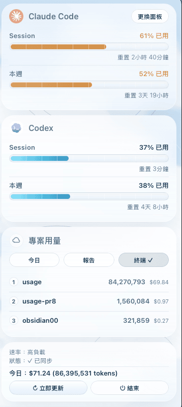
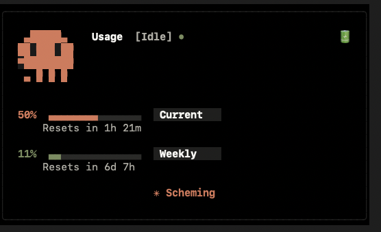
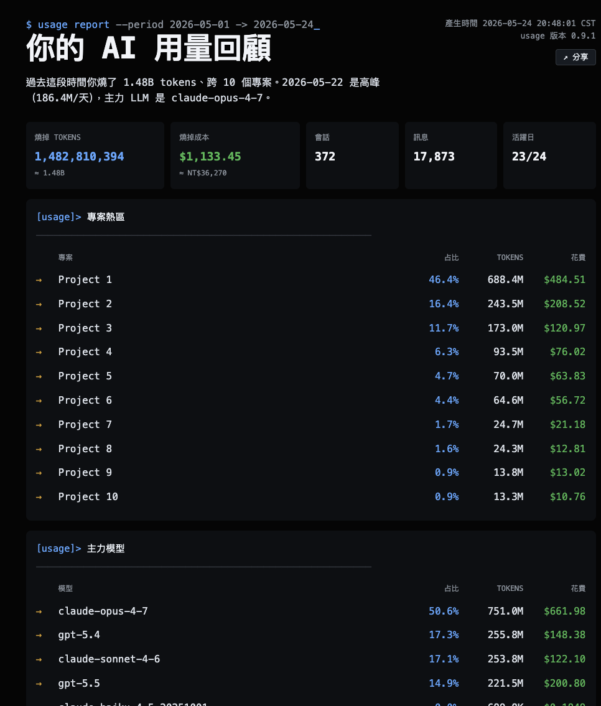

# 開發文件

繁體中文 · [English](DEVELOPMENT.en.md)

從原始碼執行 usage、跑 TUI / CLI、設定可偵測的 agent、打包 `.app` 的完整說明。一般使用者只想裝來用的話，看 [README](../README.zh-TW.md) 就夠了。

## 它怎麼拿到你的用量數字

用量數字來自 Claude Code 跟 Codex 在你本機留下的檔案，不呼叫 Anthropic / OpenAI 的 API。會連網的只有兩件事：(1) 估算 Codex 成本時需要 token 單價表，如果本機沒有快取（`~/.claude/pricing_cache.json`），會先用內建 fallback 價格立即顯示成本估算，再在背景嘗試從公開的 [LiteLLM 價格表](https://github.com/BerriAI/litellm) 下載並快取，7 天後過期再抓；下載失敗不影響用量百分比顯示，網路恢復後會自動更新價格表；(2) v0.11.0 起每天最多一次到 GitHub Releases API 查有沒有新版（可在「更換面板」選單關掉）。

### Claude Code 用量

usage 會幫你裝一個小腳本，這個小腳本叫做 **statusLine hook**（hook 就是「事件觸發點」，每次 Claude Code 刷新狀態列就會自動跑一次的小程式）。流程是這樣：

1. Claude Code 每次更新狀態列時，會把「這 5 小時用了百分之幾、這 7 天用了百分之幾」這類資訊整理成 JSON
2. 透過標準輸入（stdin）餵給 hook
3. hook 把 JSON 寫進 `~/.claude/usage-status.json` 這個檔
4. usage 主程式去讀這個檔

因為兩邊看的是同一份資料，**數字跟 Claude Code 自己看到的完全一樣**。

```mermaid
flowchart LR
    A[Claude Code 主程式] -->|每次刷新狀態列<br/>把 JSON 透過 stdin 餵給 hook| B[usage-statusline.py<br/>hook 腳本]
    B -->|寫入| C[(~/.claude/<br/>usage-status.json)]
    D[usage menu bar / TUI] -->|讀取| C
    D -->|顯示| E[macOS menu bar]
    F((Anthropic API)) -.x.- D
    style F stroke:#c0392b,stroke-dasharray:5 5
```

讀檔的優先順序：

1. `~/.claude/usage-status.json` —— usage 自己 hook 寫的
2. `~/.claude/usag-status.json` —— v0.1.x legacy 自動 fallback，新使用者不會碰到
3. `~/.claude/tt-status.json` —— 備援；給從第三方工具 [stormzhang/token-tracker](https://github.com/stormzhang/token-tracker) 升級過來的使用者，usage 會直接共用它的狀態檔（**注意：跟本專案的整合無關，純粹相容外部社群工具**）

### Codex 用量

Codex CLI 沒有 statusLine hook 這種機制，所以 usage 採另一條路：掃 Codex CLI 在 `~/.codex/sessions/` 底下留下的 `*.jsonl` 對話紀錄檔。Codex 每次對話會在紀錄裡寫入 `rate_limits`（配額資訊），usage 直接讀裡面的 5 小時跟 7 天用量百分比，不需要自己計算。今日的 token 用量跟成本則從同一份紀錄的 token 統計加總。

要注意的是：Codex 只是**偶爾**才把 `rate_limits` 寫進紀錄，不像 Claude Code 會即時回報，所以這個數字可能**落後你的實際用量**（在網頁上用的更不會進到本機檔）。當本機快照超過 15 分鐘，Codex 卡會標出「約 N 分鐘前」提醒你這是舊資料。維持離線是刻意的——這樣 usage 不會多耗你的 token。

沒裝 Codex 或沒這個資料夾的話，這部分會自動隱藏，不會影響 Claude Code 那邊的顯示。

## 拿到原始碼

```bash
git clone https://github.com/aqua5230/usage.git
cd usage
```

不熟 git 也可以到 [GitHub 專案頁](https://github.com/aqua5230/usage) 點右上角綠色的 **Code → Download ZIP**，解壓縮後 `cd` 進那個資料夾。

## 建環境

下面這幾行會幫你開一個**獨立的 Python 環境**（venv，virtual environment 的縮寫，就像幫這個專案開一個專用的抽屜，跟系統 Python 分開，互不干擾），然後把 usage 跟它需要的套件裝進去：

```bash
python3 -m venv .venv
source .venv/bin/activate
pip install -e .
```

`source .venv/bin/activate` 是「進入這個抽屜」的意思 —— 跑完之後你 terminal 提示字元前面會多一個 `(.venv)`，代表現在 Python 指令會在這個獨立環境裡跑。

## 設定可偵測到的 agent

> 用 .app 的話，第一次打開直接點 popover 上的「設定狀態列」按鈕即可。下面是給從原始碼跑 usage 的開發者用的。

這個指令會設定目前偵測到的 agent：Codex 會更新 `~/.codex/config.toml` 的 `tui.status_line`；如果你也有 Claude Code，會把 usage 的 hook 腳本複製到 `~/.claude/` 裡，再去改 Claude Code 的設定檔，讓它每次刷新狀態列時去叫這個 hook。

```bash
source .venv/bin/activate
python3 main.py --setup
```

**跑完後請重開一次 Codex**。如果有設定 Claude Code，也請重開一次 Claude Code，這樣它才會重新讀 `~/.claude/settings.json` 並刷新一次狀態列（資料這時候才會落到磁碟）。

setup 具體做了什麼：

- 如果有 Codex，在 `~/.codex/config.toml` 設定 `tui.status_line`
- 如果有 Claude Code，把 `usage_statusline.py` 複製到 `~/.claude/usage-statusline.py`
- 如果有 Claude Code，在 `~/.claude/settings.json` 把 `statusLine` 指向這個 hook
- 如果你本來就有自訂的 Claude Code statusLine，會自動備份到 `settings.usage.previousStatusLine`，不會被蓋掉

要卸載：

```bash
python3 main.py --unsetup
```

unsetup 會把原本的 Codex `status_line` 與 Claude Code `statusLine` 還原回去，並刪掉 Claude hook 跟 `~/.claude/usage-status.json`。

> **備援：手動 curl 安裝**
> 若 .app 的「設定狀態列」按鈕按了沒反應、或你想用指令模式裝，打開 Terminal（終端機）執行以下指令（先下載、確認內容後再執行，比較安全）：
>
> ```bash
> curl -fsSL https://raw.githubusercontent.com/aqua5230/usage/main/scripts/install-hook.sh -o /tmp/usage-install.sh
> cat /tmp/usage-install.sh   # 可先瀏覽腳本內容
> bash /tmp/usage-install.sh
> ```

## 跑起來

### Menu bar 模式（預設、推薦）

啟動後會在 macOS 右上角的選單列常駐，平常只顯示一行小小的百分比；點下去就會展開完整的 popover（彈出小視窗）。

```bash
source .venv/bin/activate
python3 main.py
```

- **選單列那行字長這樣**：`🐾 37%`；如果同時有 Codex 用量，會變成 `🐾 37% · 📜 10%`：

  

- **點一下會展開 popover**，分四塊：
  1. 上面兩張卡片分別是 Claude Code 跟 Codex；每張各有 Session 跟 Weekly 兩條進度條
  2. 專案用量卡：列出近期用量前三名的專案，可點右上角按鈕在「今日 / 7 日 / 月」三段之間切換
  3. 最下面那張小卡是目前速率、同步狀態、今日 token 用量與成本估算（Claude 若 log 有提供實際金額則直接顯示；Codex 成本為依 token 數估算）
  4. 兩顆按鈕：「立即更新」、「結束」
- **面板**：點右上角「更換面板」按鈕可切換面板樣式。目前內建九款面板——「預設」（簡潔白色卡片）、「駭客任務」（黑底螢光綠＋數位雨動畫）、「視窗 95」（Windows 95 復古介面）、「復古報紙」（米黃報紙風）、「雲圖觀測」（氣象風玻璃卡片）、「午夜水族箱」（深海動畫）、「稜鏡街機」（彩虹全息動畫）、「黑洞視界」（旋轉吸積盤）、以及全新「世界盃 2026」——FIFA 轉播 HUD 風格，鮮綠球場、棒人球員追球踢球互動動畫、雙向對戰記分條。

  <p align="center">
    
    &nbsp;&nbsp;
    
    &nbsp;&nbsp;
    
  </p>

  選擇會記進 `NSUserDefaults`（macOS 內建的偏好設定儲存區），下次開 app 會記得上次選的面板。
- **更新檢查（v0.11.0+）**：app 啟動會自動到 GitHub Releases 查最新版（24 小時最多一次，避免每次開都被打擾）。發現新版會跳對話框顯示版本＋ release notes，三顆按鈕：「前往下載 / 稍後再說 / 跳過此版本」。「更換面板」選單裡有「自動檢查更新」（可關閉）和「立即檢查更新」兩個項目。
- **權限提醒**：第一次啟動時，macOS 可能會問你要不要讓它在背景跑，點「允許」就好。

### 終端機 TUI 模式

如果你比較喜歡留在終端機，可以用 TUI（Text-based UI，文字版的圖形介面）模式 —— 畫面全部畫在終端機裡，不開新視窗，靠不停重畫文字模擬動畫效果。會有一個 Claude 的像素藝術 logo、旋轉的 spinner、輪播 Claude Code 那套搞笑 loading 字串，以及跟 menu bar 同樣的兩條進度條：

<p align="center">
  
</p>

```bash
source .venv/bin/activate
python3 main.py --tui
```

按 `Ctrl+C` 退出。

## 報告與深度分析（CLI）

除了選單列跟 TUI，還有一個分析用的 CLI 進入點 `usage_cli.py`，可以匯出 HTML 報告、或在終端機開互動式 dashboard（儀表板，互動式統計面板）：

<p align="center">
  
</p>

```bash
source .venv/bin/activate

# 互動式 dashboard（自動偵測 Claude / Codex 兩邊用量，用方向鍵切換）
python3 usage_cli.py

# 只看 Claude Code / 只看 Codex
python3 usage_cli.py claude
python3 usage_cli.py codex

# 產生 HTML 報告並用預設瀏覽器打開（預設範圍：近 30 天）
python3 usage_cli.py report
python3 usage_cli.py report --today              # 今日
python3 usage_cli.py report --week               # 本週
python3 usage_cli.py report --month              # 本月
python3 usage_cli.py report --all                # 全部資料
python3 usage_cli.py report --out report.html    # 另存到指定位置

# 純文字統計表
python3 usage_cli.py daily
python3 usage_cli.py weekly
python3 usage_cli.py monthly
```

HTML 報告包含：每日 / 週 / 月 token 與成本走勢、各專案排名、Top 模型分布。右上角的「分享」按鈕可另存 `.html` 或複製檔案路徑，透過 AirDrop / Mail / Slack / iMessage 把報告傳給同事或主管；對方瀏覽器打開即可閱讀。報告內含「隱藏專案名稱」勾選框（預設打勾，隱私優先），勾選後另存的 HTML 會把所有專案名稱替換成 `Project 1 / Project 2 / ...`，不影響當前螢幕顯示。

## 開機自動啟動

LaunchAgent 是 macOS 內建的背景服務管理器（負責「使用者登入後要幫忙啟動哪些程式」），可以讓 usage 在你登入時自動跑起來，不用每次手動啟動。

**最簡單的做法**：點選單列圖示展開 popover，按「⇄ 更換面板」按鈕，選單最下面有「開機自動啟動」一項，勾選即可。.app 版與原始碼版皆適用，不需跑任何指令。

下面的腳本是給原始碼使用者的另一種安裝方式：

1. **安裝**：
   ```bash
   ./scripts/install-launchagent.sh
   ```
   這個指令會在 `~/Library/LaunchAgents/` 底下放一份設定檔，然後立刻把 usage 載入起來。

2. **手動啟動（測試用）**：
   ```bash
   launchctl start com.lollapalooza.usage
   ```

3. **查看 log**（log 就是這個服務跑的時候的「日誌」，裡面有訊息跟錯誤紀錄）：
   - 一般訊息：`~/Library/Logs/usage/usage.log`
   - 錯誤訊息：`~/Library/Logs/usage/usage.err.log`

4. **移除**：
   ```bash
   ./scripts/uninstall-launchagent.sh
   ```

## 想先看看 UI 長什麼樣（預覽模式）

還沒裝 hook、或者只想看看介面長什麼樣，可以用假資料（mock data）跑一次：

```bash
# Menu bar 預覽
python3 main.py --mock

# TUI 預覽
python3 main.py --tui --mock
```

## 全部可用參數

- `--setup` / `--unsetup`：設定 / 還原偵測到的 agent（Codex `status_line`；Claude Code `statusLine` hook）。
- `--tui`：強制使用終端機 TUI 模式（不開 menu bar）。
- `--interval N`：UI 多久重新讀一次狀態檔（秒）。最小值 30，預設 60。
- `--mock`：用假資料跑，不讀任何狀態檔。
- `--force-group {0,1,2,3}`：強制指定速率分組（只有 TUI 模式有效）。

## 除錯

想看 usage 內部有沒有吞掉什麼錯誤（例如 OSError，作業系統相關錯誤），啟動時加環境變數：

```bash
USAGE_DEBUG=1 python3 main.py
```

## 語言

usage 會自動偵測 macOS 系統語言，目前支援：

| 系統語言 | 顯示語言 |
|---------|---------|
| 繁體中文 | 繁體中文 |
| 簡體中文 | 简体中文 |
| 日文 | 日本語 |
| 韓文 | 한국어 |
| 其他 | English |

開發或測試時可用環境變數強制指定：

```bash
USAGE_LANG=en python3 main.py      # 英文
USAGE_LANG=ja python3 main.py      # 日文
USAGE_LANG=ko python3 main.py      # 韓文
USAGE_LANG=zh-CN python3 main.py   # 簡體中文
```

## 一些行為說明

- usage 只讀 `~/.claude/usage-status.json`、v0.1.x 留下的 `~/.claude/usag-status.json`、`~/.claude/tt-status.json`，以及 Codex 的 session 檔。不呼叫 Anthropic / OpenAI API、不讀 Keychain。會連網的情況有兩個：(a) 首次估算 Codex 成本時下載 LiteLLM 價格表（快取 7 天，離線也能用 fallback）；(b) v0.11.0 起每天最多一次到 GitHub Releases API 查有沒有新版（可在「更換面板」選單關閉）。
- Claude Code 沒在跑的時候，狀態檔不會更新；但因為實際用量也不會變（除非重置時間到了），所以顯示的數字仍然是有效的；重置時間過了會自動歸零。
- 如果狀態檔超過 6 小時沒被更新過，會在狀態訊息標註 `⚠ usage stale Nm`（N 為實際分鐘數），提示資料可能過時。

## 打包成 .app（不開終端機就能跑）

想要雙擊圖示就跑、不開終端機，可以打包成 macOS 原生 App（.app 就是 macOS 看到的圖示，本質是一個目錄，裡面把程式跟資源打包在一起）：

```bash
./scripts/build_app.sh
```

跑完產物會在 `dist/usage.app`。雙擊或 `open dist/usage.app` 就能跑。

> **打包環境提醒**：本機打包 `.app` 請使用 `uv`（不要用 conda 的 Python）。conda 自帶的 `libffi` / `libsqlite3`（動態程式庫，程式跑時需要載入的共用程式碼）不會被 py2app 自動帶進 `.app`，會導致打出來的 `.app` 一啟動就閃退。CI 打包流程使用 `uv`，已通過測試。

每次發 GitHub Release（push 一個 `v*` 開頭的 tag 時），CI 會自動 build 並把 `usage.app.zip` 附加到 Release 頁面。
